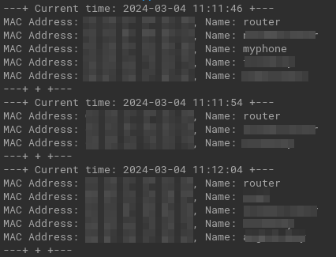

# MAC Address Finder



### Overview
This bash script is designed to continuously scan a local network using `nmap`, extract MAC addresses from the scan results, and search for corresponding names in a text file. It provides a simple and effective way to monitor network activity and detect any unauthorized devices.

## Prerequisites
- `nmap` and `bash` installed on the system
- Text file (`list.txt`) containing MAC addresses and corresponding names

## Notes
1. Devices can manually set their MAC addresses, potentially leading to inaccuracies in identification.

## Usage
1. Example `list.txt` Format
    - Make sure that all capital letters
    ```bash
    00:11:22:33:44:55 = Device1
    AA:BB:CC:DD:EE:FF = Device2
    ```
2. Manually put your target IP range in the script:
    ```bash
    # Run the nmap command and store the output in a variable
    # change your target here
    nmap_output=$(sudo nmap -sn YOUR_TARGET_IP_RANGE)
    ```
3. Make the script executable:
    ```bash
    chmod +x mac_address_finder.sh
    ```
4. Execute the script:
    ```bash
    ./mac_address_finder.sh
    ```

## Disclaimer
This script is provided as-is and should be used responsibly and in accordance with local laws and regulations. The author is not responsible for any misuse or unauthorized access to networks.